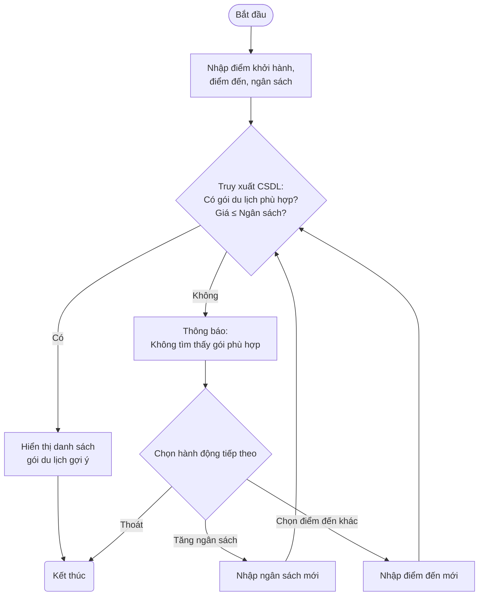

```mermaid
flowchart TD
    A([Bắt đầu]) --> B[Nhập điểm khởi hành,<br>điểm đến, ngân sách]
    B --> C{Truy xuất CSDL:<br>Có gói du lịch phù hợp?<br>Giá ≤ Ngân sách?}
    
    C -- Có --> D[Hiển thị danh sách<br>gói du lịch gợi ý]
    C -- Không --> F[Thông báo:<br>Không tìm thấy gói phù hợp]

    
    F --> G{Chọn hành động tiếp theo}
    
    G -->|Tăng ngân sách| H[Nhập ngân sách mới]
    H --> C
    
    G -->|Chọn điểm đến khác| I[Nhập điểm đến mới]
    I --> C
    D --> E(Kết thúc)
    G -->|Thoát| E
```