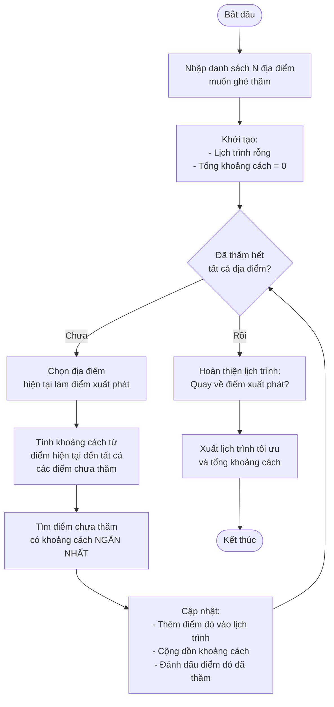

```mermaid
flowchart TD
    A([Bắt đầu]) --> B[Nhập danh sách N địa điểm<br>muốn ghé thăm]
    B --> C[Khởi tạo:<br>- Lịch trình rỗng<br>- Tổng khoảng cách = 0]
    C --> D{Đã thăm hết<br>tất cả địa điểm?}
    
    D -- Chưa --> E[Chọn địa điểm<br>hiện tại làm điểm xuất phát]
    E --> F[Tính khoảng cách từ<br>điểm hiện tại đến tất cả<br>các điểm chưa thăm]
    F --> G[Tìm điểm chưa thăm<br>có khoảng cách NGẮN NHẤT]
    G --> H[Cập nhật:<br>- Thêm điểm đó vào lịch trình<br>- Cộng dồn khoảng cách<br>- Đánh dấu điểm đó đã thăm]
    H --> D

    D -- Rồi --> I[Hoàn thiện lịch trình:<br>Quay về điểm xuất phát?]
    I --> J[Xuất lịch trình tối ưu<br>và tổng khoảng cách]
    J --> K([Kết thúc])

```