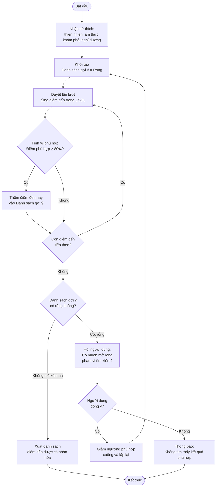

```mermaid
flowchart TD
    A([Bắt đầu]) --> B[Nhập sở thích:<br>thiên nhiên, ẩm thực,<br>khám phá, nghỉ dưỡng]
    B --> C[Khởi tạo<br>Danh sách gợi ý = Rỗng]
    C --> D[Duyệt lần lượt<br>từng điểm đến trong CSDL]
    
    D --> E{Tính % phù hợp<br>Điểm phù hợp ≥ 80%?}
    E -- Có --> F[Thêm điểm đến này<br>vào Danh sách gợi ý]
    F --> G{Còn điểm đến<br>tiếp theo?}
    
    E -- Không --> G
    
    G -- Có --> D
    
    G -- Không --> H{Danh sách gợi ý<br>có rỗng không?}
    
    H -- Không, có kết quả --> I[Xuất danh sách<br>điểm đến được cá nhân hóa]
    I --> J([Kết thúc])
    
    H -- Có, rỗng --> K[Hỏi người dùng:<br>Có muốn mở rộng<br>phạm vi tìm kiếm?]
    K --> L{Người dùng<br>đồng ý?}
    
    L -- Có --> M[Giảm ngưỡng phù hợp<br>xuống và lặp lại]
    M --> C
    
    L -- Không --> N[Thông báo:<br>Không tìm thấy kết quả phù hợp]
    N --> J
```