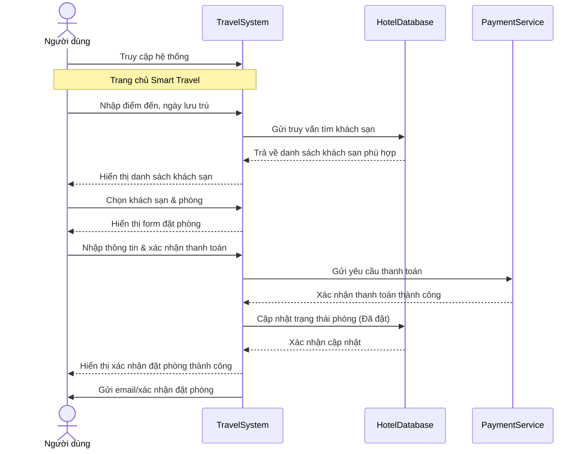

```mermaid
sequenceDiagram
    actor User as Người dùng
    participant TS as TravelSystem
    participant HD as HotelDatabase
    participant PS as PaymentService

    User ->> TS: Truy cập hệ thống
    Note over User, TS: Trang chủ Smart Travel

    User ->> TS: Nhập điểm đến, ngày lưu trú
    TS ->> HD: Gửi truy vấn tìm khách sạn
    HD -->> TS: Trả về danh sách khách sạn phù hợp
    TS -->> User: Hiển thị danh sách khách sạn

    User ->> TS: Chọn khách sạn & phòng
    TS -->> User: Hiển thị form đặt phòng

    User ->> TS: Nhập thông tin & xác nhận thanh toán
    TS ->> PS: Gửi yêu cầu thanh toán
    PS -->> TS: Xác nhận thanh toán thành công
    
    TS ->> HD: Cập nhật trạng thái phòng (Đã đặt)
    HD -->> TS: Xác nhận cập nhật

    TS -->> User: Hiển thị xác nhận đặt phòng thành công
    TS ->> User: Gửi email/xác nhận đặt phòng
```