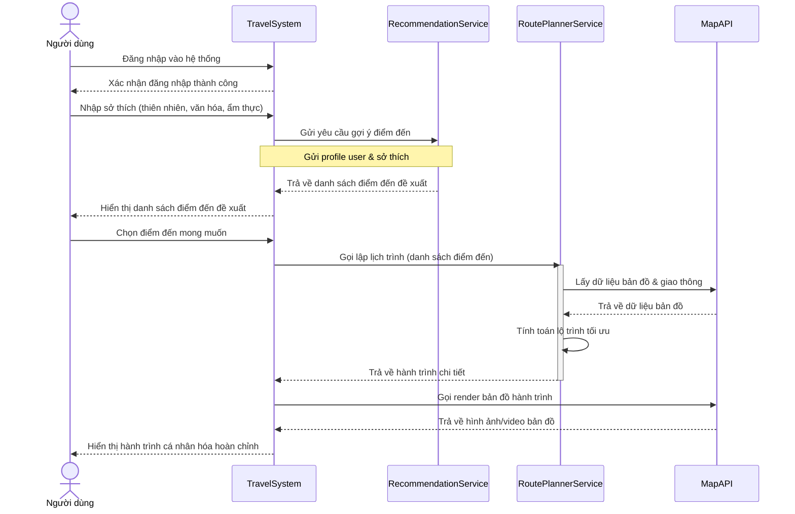

```mermaid
sequenceDiagram
    actor User as Người dùng
    participant TS as TravelSystem
    participant RS as RecommendationService
    participant RPS as RoutePlannerService
    participant MA as MapAPI

    User ->> TS: Đăng nhập vào hệ thống
    TS -->> User: Xác nhận đăng nhập thành công
    
    User ->> TS: Nhập sở thích (thiên nhiên, văn hóa, ẩm thực)
    
    TS ->> RS: Gửi yêu cầu gợi ý điểm đến
    Note over TS, RS: Gửi profile user & sở thích
    RS -->> TS: Trả về danh sách điểm đến đề xuất
    
    TS -->> User: Hiển thị danh sách điểm đến đề xuất
    
    User ->> TS: Chọn điểm đến mong muốn
    
    TS ->> RPS: Gọi lập lịch trình (danh sách điểm đến)
    activate RPS
    
    RPS ->> MA: Lấy dữ liệu bản đồ & giao thông
    MA -->> RPS: Trả về dữ liệu bản đồ
    
    RPS ->> RPS: Tính toán lộ trình tối ưu
    RPS -->> TS: Trả về hành trình chi tiết
    deactivate RPS
    
    TS ->> MA: Gọi render bản đồ hành trình
    MA -->> TS: Trả về hình ảnh/video bản đồ
    
    TS -->> User: Hiển thị hành trình cá nhân hóa hoàn chỉnh
```