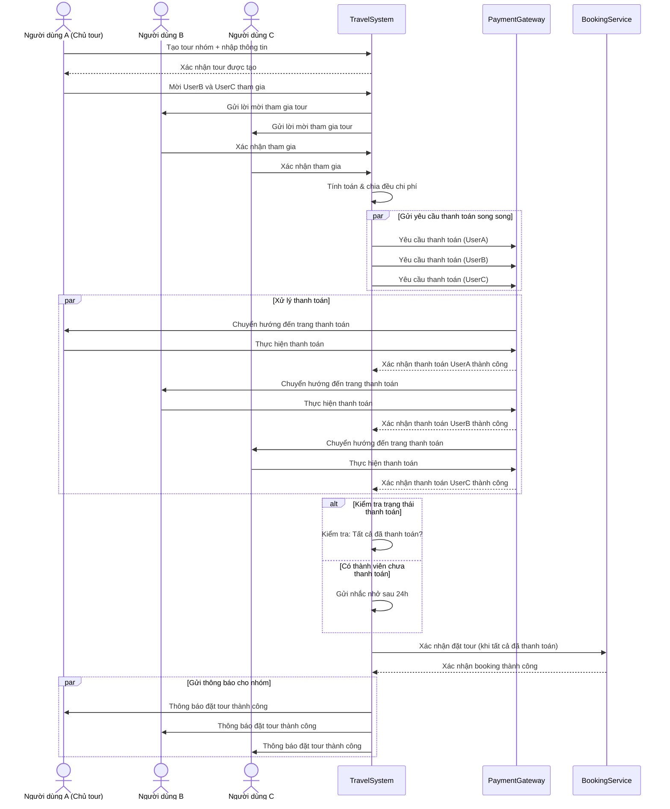

```mermaid
sequenceDiagram
    actor UserA as Người dùng A (Chủ tour)
    actor UserB as Người dùng B
    actor UserC as Người dùng C
    participant TS as TravelSystem
    participant PG as PaymentGateway
    participant BS as BookingService

    UserA ->> TS: Tạo tour nhóm + nhập thông tin
    TS -->> UserA: Xác nhận tour được tạo
    
    UserA ->> TS: Mời UserB và UserC tham gia
    TS ->> UserB: Gửi lời mời tham gia tour
    TS ->> UserC: Gửi lời mời tham gia tour
    
    UserB ->> TS: Xác nhận tham gia
    UserC ->> TS: Xác nhận tham gia
    
    TS ->> TS: Tính toán & chia đều chi phí
    
    par Gửi yêu cầu thanh toán song song
        TS ->> PG: Yêu cầu thanh toán (UserA)
        TS ->> PG: Yêu cầu thanh toán (UserB) 
        TS ->> PG: Yêu cầu thanh toán (UserC)
    end
    
    par Xử lý thanh toán
        PG ->> UserA: Chuyển hướng đến trang thanh toán
        UserA ->> PG: Thực hiện thanh toán
        PG -->> TS: Xác nhận thanh toán UserA thành công
        
        PG ->> UserB: Chuyển hướng đến trang thanh toán
        UserB ->> PG: Thực hiện thanh toán
        PG -->> TS: Xác nhận thanh toán UserB thành công
        
        PG ->> UserC: Chuyển hướng đến trang thanh toán
        UserC ->> PG: Thực hiện thanh toán
        PG -->> TS: Xác nhận thanh toán UserC thành công
    end
    
    alt Kiểm tra trạng thái thanh toán
        TS ->> TS: Kiểm tra: Tất cả đã thanh toán?
    else Có thành viên chưa thanh toán
        TS ->> TS: Gửi nhắc nhở sau 24h
    end
    
    TS ->> BS: Xác nhận đặt tour (khi tất cả đã thanh toán)
    BS -->> TS: Xác nhận booking thành công
    
    par Gửi thông báo cho nhóm
        TS ->> UserA: Thông báo đặt tour thành công
        TS ->> UserB: Thông báo đặt tour thành công
        TS ->> UserC: Thông báo đặt tour thành công
    end
```