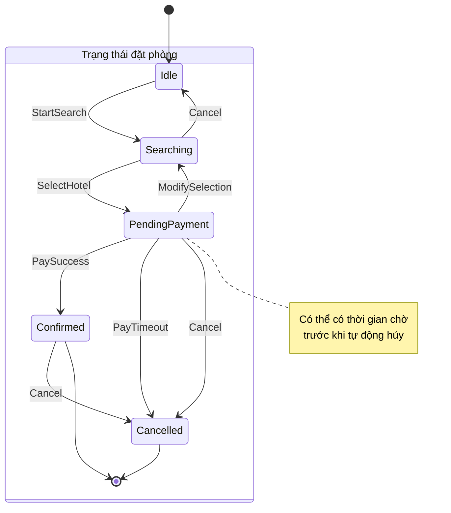

```mermaid
stateDiagram-v2
    [*] --> Idle
    
    state "Trạng thái đặt phòng" as main {
        Idle --> Searching : StartSearch
        
        Searching --> PendingPayment : SelectHotel
        Searching --> Idle : Cancel
        
        PendingPayment --> Confirmed : PaySuccess
        PendingPayment --> Cancelled : PayTimeout
        PendingPayment --> Cancelled : Cancel
        PendingPayment --> Searching : ModifySelection
        
        Confirmed --> Cancelled : Cancel
        Confirmed --> [*]
        
        Cancelled --> [*]
    }
    
    note right of PendingPayment
        Có thể có thời gian chờ
        trước khi tự động hủy
    end note
```