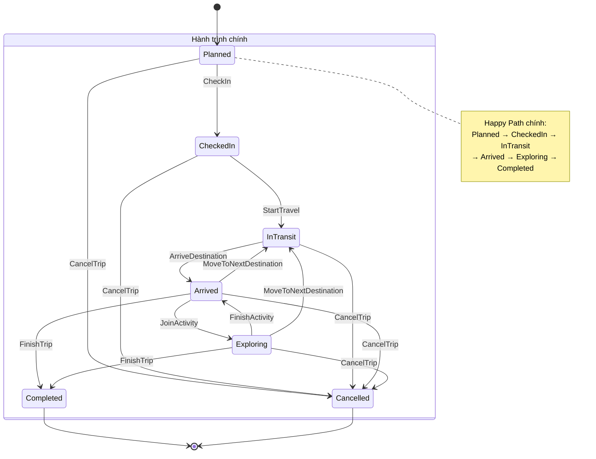

```mermaid
stateDiagram-v2
    [*] --> Planned
    
    state "Hành trình chính" as main {
        Planned --> CheckedIn : CheckIn
        Planned --> Cancelled : CancelTrip
        
        CheckedIn --> InTransit : StartTravel
        CheckedIn --> Cancelled : CancelTrip
        
        InTransit --> Arrived : ArriveDestination
        InTransit --> Cancelled : CancelTrip
        
        Arrived --> Exploring : JoinActivity
        Arrived --> InTransit : MoveToNextDestination
        Arrived --> Cancelled : CancelTrip
        
        Exploring --> Arrived : FinishActivity
        Exploring --> InTransit : MoveToNextDestination
        Exploring --> Cancelled : CancelTrip
        
        Arrived --> Completed : FinishTrip
        Exploring --> Completed : FinishTrip
    }
    
    Completed --> [*]
    Cancelled --> [*]
    
    note right of Planned
        Happy Path chính:
        Planned → CheckedIn → InTransit
        → Arrived → Exploring → Completed
    end note
```