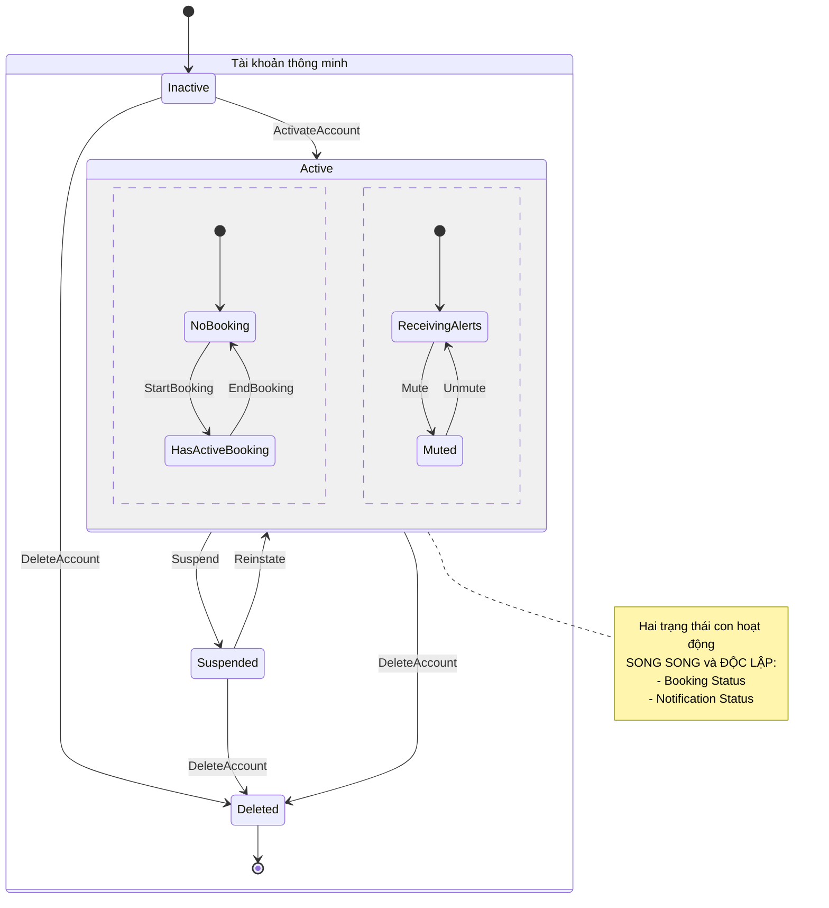

```mermaid
stateDiagram-v2
    [*] --> Inactive

    state "Tài khoản thông minh" as account {
        Inactive --> Active : ActivateAccount
        Inactive --> Deleted : DeleteAccount
        
        Active --> Suspended : Suspend
        Active --> Deleted : DeleteAccount
        
        Suspended --> Active : Reinstate
        Suspended --> Deleted : DeleteAccount
        
        Deleted --> [*]
        
        state Active {
            [*] --> NoBooking
            NoBooking --> HasActiveBooking : StartBooking
            HasActiveBooking --> NoBooking : EndBooking
            
            --
            
            [*] --> ReceivingAlerts
            ReceivingAlerts --> Muted : Mute
            Muted --> ReceivingAlerts : Unmute
        }
    }

    note right of Active
        Hai trạng thái con hoạt động
        SONG SONG và ĐỘC LẬP:
        - Booking Status
        - Notification Status
    end note
```