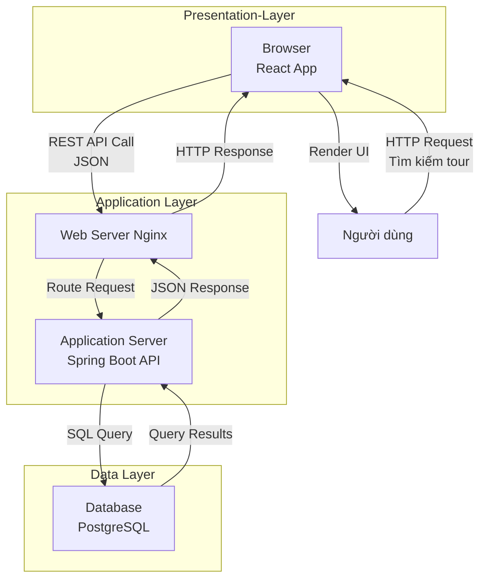

```mermaid
flowchart TD
    subgraph A [Presentation-Layer]
        B[Browser<br/>React App]
    end

    subgraph C [Application Layer]
        D[Web Server Nginx]
        E[Application Server<br/>Spring Boot API]
    end

    subgraph F [Data Layer]
        G[Database<br/>PostgreSQL]
    end

    User[Người dùng] -->|HTTP Request<br/>Tìm kiếm tour| B
    B -->|REST API Call<br/>JSON| D
    D -->|Route Request| E
    E -->|SQL Query| G
    G -->|Query Results| E
    E -->|JSON Response| D
    D -->|HTTP Response| B
    B -->|Render UI| User
```