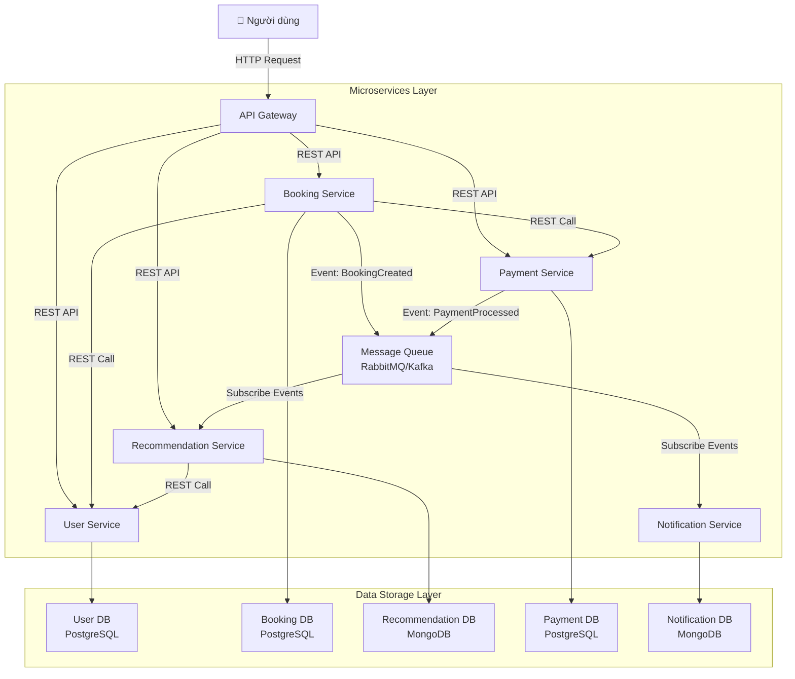

```mermaid
flowchart TD
    User[👤 Người dùng] -->|HTTP Request| GW[API Gateway]
    
    subgraph Microservices [Microservices Layer]
        GW -->|REST API| US[User Service]
        GW -->|REST API| BS[Booking Service]
        GW -->|REST API| RS[Recommendation Service]
        GW -->|REST API| PS[Payment Service]
        
        BS -->|Event: BookingCreated| MQ[Message Queue<br/>RabbitMQ/Kafka]
        PS -->|Event: PaymentProcessed| MQ
        MQ -->|Subscribe Events| NS[Notification Service]
        MQ -->|Subscribe Events| RS
    end

    subgraph DataLayer [Data Storage Layer]
        US --> UDB[User DB<br/>PostgreSQL]
        BS --> BDB[Booking DB<br/>PostgreSQL]
        RS --> RDB[Recommendation DB<br/>MongoDB]
        PS --> PDB[Payment DB<br/>PostgreSQL]
        NS --> NDB[Notification DB<br/>MongoDB]
    end

    %% Internal communications
    BS -->|REST Call| US
    BS -->|REST Call| PS
    RS -->|REST Call| US
```