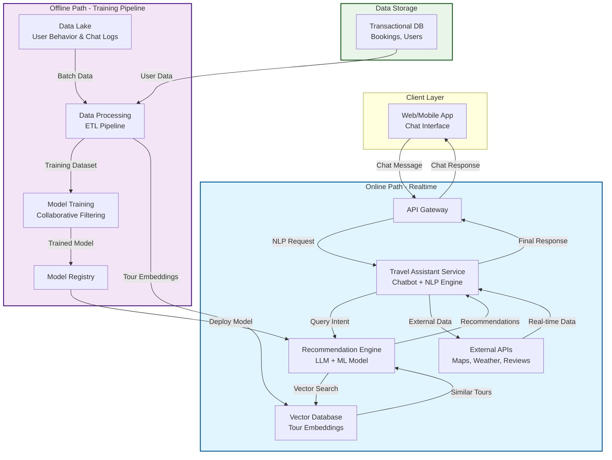

```mermaid
flowchart TD
    subgraph A [Client Layer]
        UI[Web/Mobile App<br/>Chat Interface]
    end

    subgraph B [Online Path - Realtime]
        UI -->|Chat Message| GW[API Gateway]
        GW -->|NLP Request| TA[Travel Assistant Service<br/>Chatbot + NLP Engine]
        TA -->|Query Intent| RE[Recommendation Engine<br/>LLM + ML Model]
        RE -->|Vector Search| VD[Vector Database<br/>Tour Embeddings]
        VD -->|Similar Tours| RE
        RE -->|Recommendations| TA
        TA -->|External Data| EXT[External APIs<br/>Maps, Weather, Reviews]
        EXT -->|Real-time Data| TA
        TA -->|Final Response| GW
        GW -->|Chat Response| UI
    end

    subgraph C [Offline Path - Training Pipeline]
        DL[Data Lake<br/>User Behavior & Chat Logs] -->|Batch Data| DP[Data Processing<br/>ETL Pipeline]
        DP -->|Training Dataset| MT[Model Training<br/>Collaborative Filtering]
        MT -->|Trained Model| RM[Model Registry]
        RM -->|Deploy Model| RE
        DP -->|Tour Embeddings| VD
    end

    subgraph D [Data Storage]
        DL
        TS[Transactional DB<br/>Bookings, Users]
        TS -->|User Data| DP
    end

    %% Styling
    classDef online fill:#e1f5fe,stroke:#01579b,stroke-width:2px
    classDef offline fill:#f3e5f5,stroke:#4a148c,stroke-width:2px
    classDef storage fill:#e8f5e8,stroke:#1b5e20,stroke-width:2px
    
    class B online
    class C offline
    class D storage
```