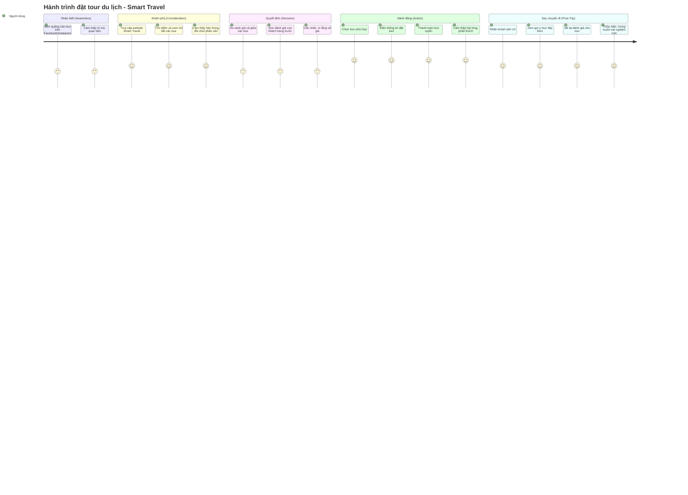

```mermaid
journey
    title Hành trình đặt tour du lịch - Smart Travel
    section Nhận biết (Awareness)
      Xem quảng cáo tour trên Facebook/Instagram: 3: Người dùng
      Cảm thấy tò mò, quan tâm: 3: Người dùng
    section Khám phá (Consideration)
      Truy cập website Smart Travel: 4: Người dùng
      Tìm kiếm và xem chi tiết các tour: 4: Người dùng
      Cảm thấy hào hứng, đôi chút phân vân: 4: Người dùng
    section Quyết định (Decision)
      So sánh giá cả giữa các tour: 3: Người dùng
      Đọc đánh giá của khách hàng trước: 3: Người dùng
      Cân nhắc, lo lắng về giá: 3: Người dùng
    section Hành động (Action)
      Chọn tour phù hợp: 5: Người dùng
      Điền thông tin đặt tour: 5: Người dùng
      Thanh toán trực tuyến: 5: Người dùng
      Cảm thấy hài lòng, phấn khích: 5: Người dùng
    section Sau chuyến đi (Post-Trip)
      Nhận email cảm ơn: 4: Người dùng
      Xem gợi ý tour tiếp theo: 4: Người dùng
      Để lại đánh giá cho tour: 4: Người dùng
      Thỏa mãn, mong muốn trải nghiệm mới: 4: Người dùng
```